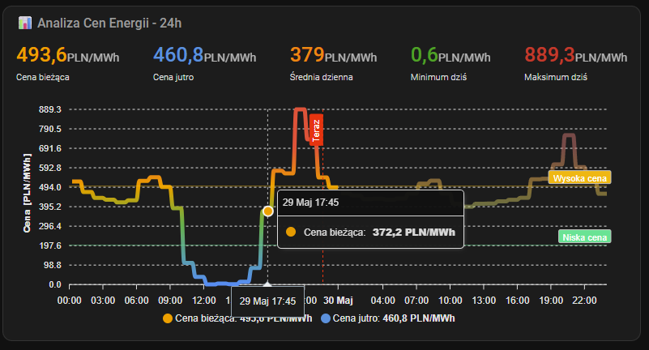
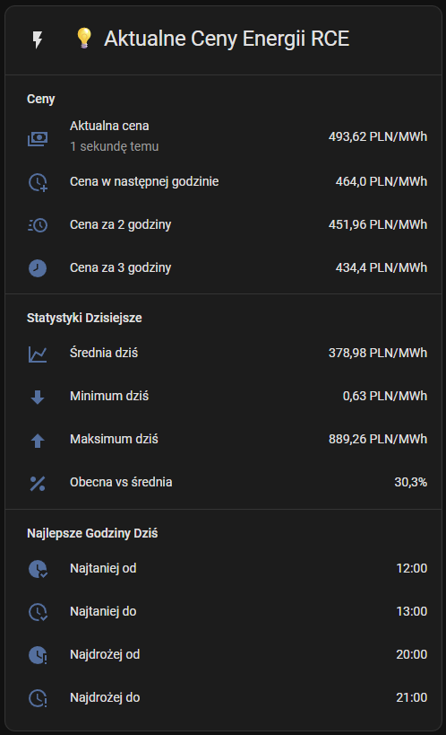

# RCE PSE Integration for Home Assistant

[](https://github.com/hacs/integration)


[](https://github.com/lewa-reka/ha-rce-pse/releases/latest)


## Rynkowa Cena Energii

A Home Assistant integration for monitoring Polish electricity market prices (RCE - Rynkowa Cena Energii) from PSE (Polskie Sieci Elektroenergetyczne).

Instalation & Presentation: <https://youtu.be/6N71uXgf9yc>

## Installation

[](https://my.home-assistant.io/redirect/hacs_repository/?owner=Lewa-Reka&repository=ha-rce-pse&category=integration)

### HACS (Recommended)

1. Open HACS in Home Assistant
2. Search for **"RCE PSE"**
3. DOWNLOAD the integration
4. Restart Home Assistant

### Manual Installation

1. Copy the `custom_components/rce_pse` folder to your Home Assistant `custom_components` directory
2. Restart Home Assistant

### Initial Setup

[](https://my.home-assistant.io/redirect/config_flow_start/?domain=rce_pse)

1. Go to **Settings** > **Integrations**
2. Click **Add Integration** and search for "RCE PSE"
3. Configure the time window settings (see below)
4. Click **Submit** to complete the setup

## Usage Examples

Here are two ready-to-use dashboard card configurations that showcase different ways to display energy price data:

### 1. Advanced Charts with ApexCharts (Additional Dependencies Required)

This card provides advanced charting capabilities with professional-looking graphs and real-time price analysis. Perfect for users who want detailed visual analytics.



**Configuration file**: [`PL: examples/pl/card2_apexcharts_analysis.yaml`](examples/pl/card2_apexcharts_analysis.yaml) [`EN: examples/en/card2_apexcharts_analysis.yaml`](examples/en/card2_apexcharts_analysis.yaml)


**Requirements:**
- `apexcharts-card` - Install via HACS → "ApexCharts Card"

### 2. Basic Overview (No Dependencies Required)

This card provides a comprehensive overview of current energy prices using standard Home Assistant entities. It's perfect for users who want a clean, simple display without additional dependencies.



**Configuration file**: [`PL: examples/pl/card1_basic_overview.yaml`](examples/pl/card1_basic_overview.yaml) [`EN: examples/en/card1_basic_overview.yaml`](examples/en/card1_basic_overview.yaml)


Both cards can be easily customized to match your dashboard theme and specific needs. Simply copy the YAML configuration from the respective files and paste them into your Home Assistant dashboard in edit mode.

## Features

- **Real-time price monitoring** - Current electricity price with 15-minute precision
- **Historical data** - Previous hour pricing information  
- **Future price forecasting** - Prices for next 1-3 hours ahead
- **Daily statistics** - Comprehensive price analysis (average, min, max, median)
- **Tomorrow's data** - Next day pricing available after 14:00 CET
- **Price comparison** - Today vs tomorrow percentage differences
- **Optimal time windows** - Configurable search for cheapest and most expensive periods
- **Smart scheduling** - Find best times for energy-intensive activities
- **Peak avoidance** - Identify and avoid high-cost electricity periods
- **Time window timestamps** - Start/end timestamps for cheapest and most expensive periods (format with templates if you need time-only display)
- **Hourly price averaging** - Optional hourly price calculation for net-billing settlements
- **Automatic updates** - Data refreshed every 30 minutes from official PSE API

## Configuration

After installing the integration, you can configure it through the Home Assistant UI. The integration offers several customization options for optimal time windows that help you find the best electricity prices for your needs.

### Configuration Options

The integration provides advanced configuration options to customize how it searches for optimal electricity price windows:

#### Cheapest Hours Search Settings

These settings control how the integration finds the most economical electricity periods:

- **Start Hour** (0-23): Beginning of the time window to search for cheapest hours
  - *Default*: 0 (midnight)
  - *Example*: Set to 22 to search from 10 PM onwards

- **End Hour** (1-24): End of the time window to search for cheapest hours  
  - *Default*: 24 (midnight next day)
  - *Example*: Set to 6 to search until 6 AM

- **Duration (hours)** (1-24): Length of the cheapest continuous time window to find
  - *Default*: 2 hours
  - *Example*: Set to 3 to find 3-hour blocks of cheapest electricity

#### Most Expensive Hours Search Settings

These settings control how the integration finds the most expensive electricity periods (useful for avoiding high-cost times):

- **Start Hour** (0-23): Beginning of the time window to search for most expensive hours
  - *Default*: 0 (midnight)
  - *Example*: Set to 16 to search from 4 PM onwards

- **End Hour** (1-24): End of the time window to search for most expensive hours
  - *Default*: 24 (midnight next day)  
  - *Example*: Set to 20 to search until 8 PM

- **Duration (hours)** (1-24): Length of the most expensive continuous time window to find
  - *Default*: 2 hours
  - *Example*: Set to 1 to find 1-hour blocks of most expensive electricity

#### Second Expensive Hours Search Settings

These settings control how the integration finds the second most expensive electricity periods in a different time window (useful for identifying multiple peak periods):

- **Start Hour** (0-23): Beginning of the time window to search for second expensive hours
  - *Default*: 6 (6 AM)
  - *Example*: Set to 8 to search from 8 AM onwards

- **End Hour** (1-24): End of the time window to search for second expensive hours
  - *Default*: 10 (10 AM)  
  - *Example*: Set to 12 to search until 12 PM

- **Duration (hours)** (1-24): Length of the second expensive continuous time window to find
  - *Default*: 2 hours
  - *Example*: Set to 1 to find 1-hour blocks of second expensive electricity

#### Hourly Prices Option

This advanced option is useful for net-billing settlements due to prosumer metering with hourly accuracy despite 15-minute prices. When enabled, the integration calculates average prices for each hour from the published quarter-hour prices.

- **Use Hourly Prices** (true/false): Enable hourly price averaging
  - *Default*: false (uses original 15-minute prices)
  - *When enabled*: Calculates average price for each hour from 15-minute intervals
  - *Use case*: Net-billing settlements according to Art. 4b sec. 11 of the Ustawa o OZE

**How it works:**
- When disabled: Uses original 15-minute price data from PSE API
- When enabled: Calculates hourly averages and applies the same price to all 15-minute intervals within each hour
- Example: If hour 0 has prices [300, 320, 340, 360] PLN, all four 15-minute intervals will show 330 PLN (average)

#### Low Sell Price Threshold

This option defines the price threshold (in PLN/MWh) used to detect "low price" windows for the dedicated sensors. Periods where the price is at or below this threshold form the first continuous low-price window for today and tomorrow.

- **Low sell price threshold** (PLN/MWh): Range -2000 to 2000 (negative values allowed, e.g. for negative market prices)
  - *Default*: 0
  - *Use case*: Sensors "Below-Threshold Window Start/End Today/Tomorrow" show the first continuous period with price ≤ threshold; binary sensor "Price Below-Threshold" is `on` when current time is inside that period today. If there is no such period in a day, the sensors report state "unknown" (integration remains available).

### Reconfiguring Settings

You can modify these settings at any time:

1. Go to **Configuration** > **Integrations**
2. Find "RCE PSE" in your integrations list
3. Click **Configure**
4. Adjust the settings as needed
5. Click **Submit** to apply changes

The integration will automatically reload with your new settings.

### Configuration Examples

**Example 1: Night Charging (Electric Vehicle)**
- Cheapest Hours: Start=22, End=6, Duration=4
- Find 4 cheapest consecutive hours between 10 PM and 6 AM

**Example 2: Business Hours Optimization**  
- Most Expensive Hours: Start=8, End=18, Duration=2
- Avoid the 2 most expensive consecutive hours during business hours

**Example 3: Peak Avoidance**
- Most Expensive Hours: Start=17, End=21, Duration=1  
- Identify the single most expensive hour during evening peak

**Example 4: Multiple Peak Identification**
- Second Expensive Hours: Start=6, End=10, Duration=2
- Find 2-hour morning peak period separate from main evening peak
- Useful for identifying both morning and evening electricity price peaks

### Additional Sensors

When you configure custom time windows, the integration provides additional sensors:

**For Today:**
- Cheapest Window Start/End, Cheapest Window Avg Today
- Expensive Window Start/End, Expensive Window Avg Today
- Second Expensive Window Start/End, Second Expensive Window Avg Today

**For Tomorrow:**
- Cheapest Window Start/End, Cheapest Window Avg Tomorrow
- Expensive Window Start/End, Expensive Window Avg Tomorrow
- Second Expensive Window Start/End, Second Expensive Window Avg Tomorrow

These sensors automatically update based on your configured search parameters. Time window start/end sensors return timestamps; use template filters (e.g. `timestamp_custom('%H:%M')`) if you need a time-only display.

## Sensors

### Main Sensors
- **Price** - Current electricity price (with all daily prices as attributes)
- **Price for kWh** - Dedicated for HomeAssistant Energy dashboard (converts PLN/MWh to PLN/kWh, includes 23% VAT, negative prices converted to 0)
- **Tomorrow Price** - Tomorrow's price (available after 14:00 CET) (with all prices for the next day as attributes)

### Future Price Sensors
- **Next Hour Price** - Price for the next hour
- **Price in 2 Hours** - Price in 2 hours
- **Price in 3 Hours** - Price in 3 hours
- **Previous Hour Price** - Price from the previous hour

### Today's Statistics
- **Today Average Price** - Average price for today
- **Today Maximum Price** - Highest price today
- **Today Minimum Price** - Lowest price today
- **Today Median Price** - Median price for today
- **Today Current vs Average** - Percentage difference between current and average price

### Tomorrow's Statistics (available after 14:00 CET)
- **Tomorrow Average Price** - Average price for tomorrow
- **Tomorrow Maximum Price** - Highest price tomorrow
- **Tomorrow Minimum Price** - Lowest price tomorrow
- **Tomorrow Median Price** - Median price for tomorrow
- **Tomorrow vs Today Average** - Percentage difference between tomorrow and today average

### Price Hours (timestamps, PSE-derived)
- **Highest Price Start/End Today** - When the highest price period starts/ends today (timestamp)
- **Lowest Price Start/End Today** - When the lowest price period starts/ends today (timestamp)
- **Highest Price Start/End Tomorrow** - When the highest price period starts/ends tomorrow (timestamp)
- **Lowest Price Start/End Tomorrow** - When the lowest price period starts/ends tomorrow (timestamp)

### Custom Time Window Sensors

Based on your configuration settings, the integration provides additional sensors for optimal time windows:

#### Today's Custom Windows
- **Cheapest Window Start/End Today** - Start and end of cheapest configured window (timestamp)
- **Cheapest Window Avg Today** - Average price within the cheapest window (PLN/MWh)
- **Expensive Window Start/End Today** - Start and end of most expensive configured window (timestamp)
- **Expensive Window Avg Today** - Average price within the most expensive window (PLN/MWh)
- **Second Expensive Window Start/End Today** - Start and end of second expensive configured window (timestamp)
- **Second Expensive Window Avg Today** - Average price within the second expensive window (PLN/MWh)

#### Tomorrow's Custom Windows (available after 14:00 CET)
- **Cheapest Window Start/End Tomorrow** - Start and end of cheapest configured window (timestamp)
- **Cheapest Window Avg Tomorrow** - Average price within the cheapest window (PLN/MWh)
- **Expensive Window Start/End Tomorrow** - Start and end of most expensive configured window (timestamp)
- **Expensive Window Avg Tomorrow** - Average price within the most expensive window (PLN/MWh)
- **Second Expensive Window Start/End Tomorrow** - Start and end of second expensive configured window (timestamp)
- **Second Expensive Window Avg Tomorrow** - Average price within the second expensive window (PLN/MWh)

#### Low Price Threshold Windows

Based on the configured low sell price threshold, the integration provides timestamp sensors for the first continuous period each day where the price is at or below the threshold:

- **Below-Threshold Window Start Today** – Start of the first period today with price at or below the threshold
- **Below-Threshold Window End Today** – End of that period today
- **Below-Threshold Window Start Tomorrow** – Start of the first such period tomorrow (available after 14:00 CET)
- **Below-Threshold Window End Tomorrow** – End of that period tomorrow

When there is no such period in a given day, these sensors show state "unknown" while the integration remains available.

Time window sensors return timestamps. To display only the time (e.g. HH:MM) in dashboards or automations, use a template with `as_timestamp()` and `timestamp_custom('%H:%M')`. See [docs/v2-sensors-changes.md](docs/v2-sensors-changes.md) for migration details from previous versions.

## Binary Sensors

The integration provides binary sensors that indicate when you are currently within specific price windows. These sensors are perfect for automation triggers and dashboard indicators.

### Today's Price Window Binary Sensors (PSE-derived)

These sensors indicate whether you are currently within the highest or lowest price periods for today:

- **Lowest Price** - `true` when currently within the lowest price period of the day
- **Highest Price** - `true` when currently within the highest price period of the day

### Custom Window Binary Sensors

Based on your configuration settings, these sensors indicate whether you are currently within your configured optimal time windows:

- **Cheapest Window** - `true` when currently within your configured cheapest time window
- **Expensive Window** - `true` when currently within your configured most expensive time window
- **Second Expensive Window** - `true` when currently within your configured second expensive time window
- **Price Below-Threshold** – `true` when current time is within the first period today where price is at or below the configured low sell price threshold

## Debugging

To enable debug logging for the RCE PSE integration, add the following to your Home Assistant `configuration.yaml`:

```yaml
logger:
  default: info
  logs:
    custom_components.rce_pse: debug
```

This will enable detailed logging for:
- Integration setup and configuration
- API requests and responses
- Data fetching and processing
- Sensor creation and updates
- Error handling and troubleshooting

After adding this configuration, restart Home Assistant and check the logs in:
- **Configuration** > **Logs** in the Home Assistant UI
- Or directly in the `home-assistant.log` file

Debug logs include:
- PSE API request URLs and parameters
- API response status and data counts
- Configuration flow steps
- Sensor setup progress
- Coordinator data updates

## Data Source

This integration fetches data from the official PSE API:
- **API**: `https://api.raporty.pse.pl/api` - API v2
- **Update Interval**: 30 minutes
- **Data Availability**: Tomorrow's prices are available after 14:00 CET

## License

This project is licensed under the Apache License 2.0 - see the [LICENSE](LICENSE) file for details.

### Apache 2.0 License

Copyright 2025 Lewa-Reka and RCE PSE Integration Contributors

Licensed under the Apache License, Version 2.0 (the "License");
you may not use this file except in compliance with the License.
You may obtain a copy of the License at

```text
http://www.apache.org/licenses/LICENSE-2.0
```

Unless required by applicable law or agreed to in writing, software
distributed under the License is distributed on an "AS IS" BASIS,
WITHOUT WARRANTIES OR CONDITIONS OF ANY KIND, either express or implied.
See the License for the specific language governing permissions and
limitations under the License.

## Contributing

Contributions are welcome! Please feel free to submit a Pull Request. For major changes, please open an issue first to discuss what you would like to change.

Please make sure to update tests as appropriate and ensure your code follows the project's coding standards.

CI runs tests (pytest), HACS and hassfest validation, and MegaLinter (Python: Ruff, Bandit, Mypy; plus JSON, YAML, Markdown, GitHub Actions). Dependabot opens PRs for dependency updates (pip and GitHub Actions).
