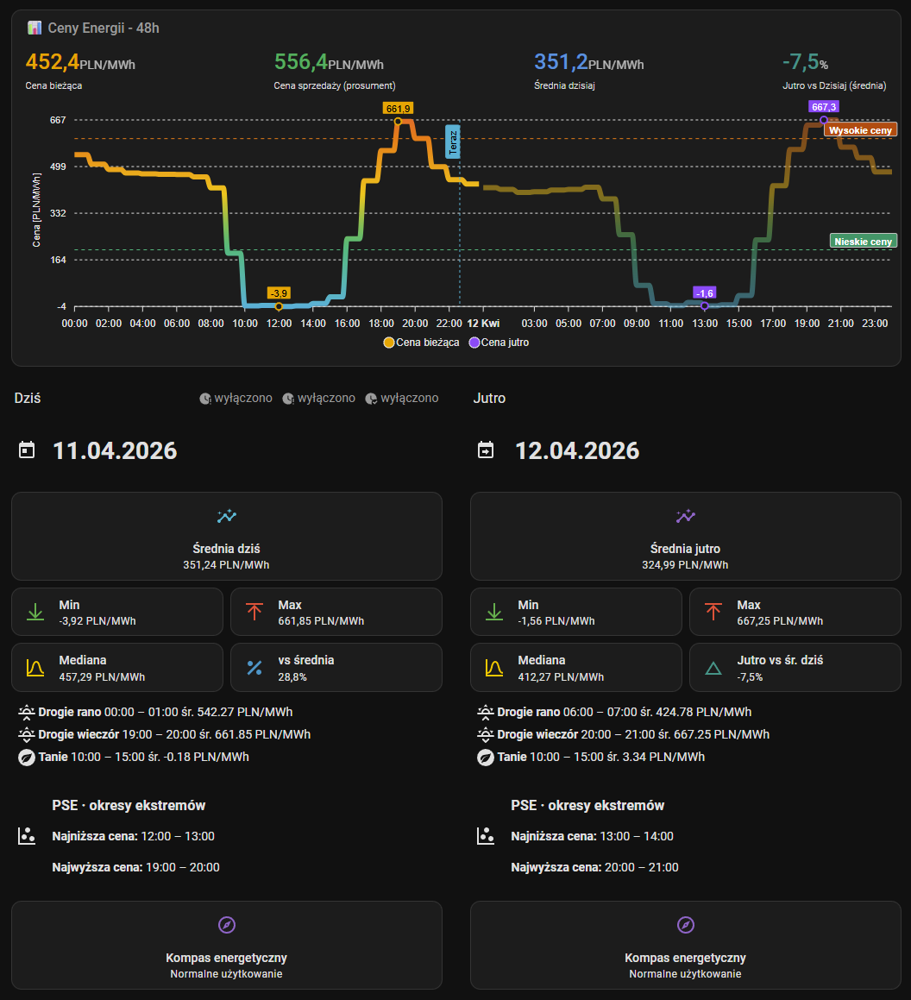

# Przykładowy dashboard Lovelace

W katalogu [examples/](../examples/) znajduje się przykładowy plik Lovelace z **dwoma widokami**: **Ceny Energii** (wykres 48h, podsumowanie Dziś/Jutro, okna cenowe itd.) oraz **Kompas Energetyczny** (`path: kompas-energetyczny`) — siatka godzin PDGSZ **4 kolumny × 6 wierszy**, legenda alertów, sensory `sensor.rce_pse_kompas_energetyczny_dzisiaj` / `sensor.rce_pse_kompas_energetyczny_jutro` (jak w reszcie przykładu: polskie `entity_id`; przy domyślnych ID integracji `sensor.rce_pse_today_peak_hours` / `…_tomorrow_peak_hours` zmień encje w HA lub w YAML).

Źródło układu: [dashboard-lovelace-PL.yaml](../examples/dashboard-lovelace-PL.yaml).

## Wymagania

- Home Assistant z widokiem typu **Sekcje** (Sections), zgodnym z formatem YAML w pliku.
- Z HACS zainstalowana karta **ApexCharts Card** (`custom:apexcharts-card`) — używana jest w górnym wierszu wykresu.
- Integracja **RCE PSE** w trybie pełnym (nie tryb Lite), żeby dostępne były wszystkie encje użyte w przykładzie.

## Dodanie widoku do Home Assistant

1. **Ustawienia** → **Pulpity** → wybierz pulpit lub utwórz nowy.
2. **Trzy kropki** przy pulpicie → **Edytuj pulpit** → **Raw configuration editor** (lub dodaj widok i przejdź do edycji YAML widoku).
3. Wklej zawartość pliku `examples/dashboard-lovelace-PL.yaml` pod `views:` (oba wpisy listy: **Ceny Energii** i **Kompas Energetyczny**) albo scal wybrane widoki z istniejącą konfiguracją `views:` ręcznie.

Po zapisaniu odśwież przeglądarkę. Jeśli Home Assistant zgłosi błąd składni YAML, sprawdź wcięcia — kopiowanie z edytora z numerami linii bywa zdradliwe.

## Nazwy encji (`entity_id`)

Przykład zakłada **polskie** nazwy encji z integracji (np. `sensor.rce_pse_cena`, `sensor.rce_pse_tanie_okno_dzisiaj_poczatek`). Przy **domyślnych** nazwach angielskich podmień identyfikatory w pliku YAML (w tym w kartach Markdown z szablonami Jinja) na swoje `entity_id`. Na dole kolumny **Dziś** znajduje się zwijana sekcja z przykładowym mapowaniem na nazwy angielskie.

## Dostępność danych „jutro”

Część kart dla jutra jest widoczna dopiero po publikacji cen przez PSE (zwykle po **14:00**). W przykładzie jest osobna karta z krótką informacją, gdy `sensor.rce_pse_cena_jutro` ma stan `unknown`.

## Grafika w repozytorium

Plik [examples/img/dashboard-lovelace-PL.png](../examples/img/dashboard-lovelace-PL.png) służy jako ilustracja w README i w tej stronie. Możesz go **nadpisać własnym zrzutem ekranu** pulpitu po imporcie — ścieżka i nazwa pliku powinny pozostać takie same, żeby odnośniki w dokumentacji działały bez zmian.
